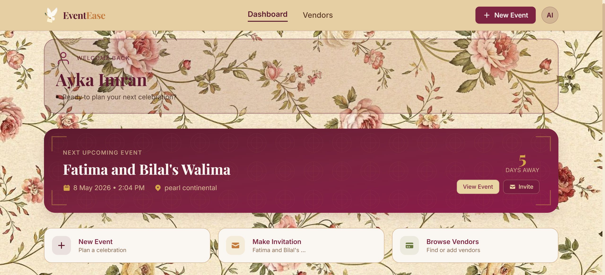
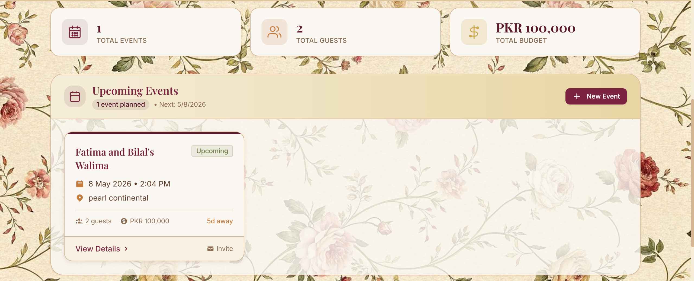
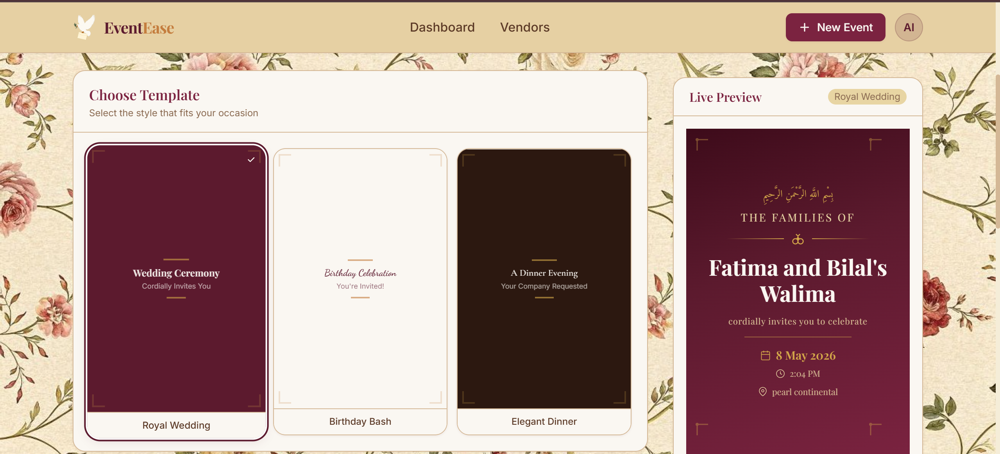
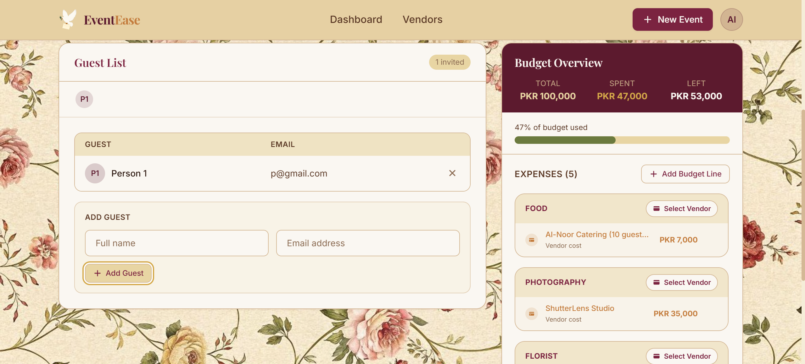
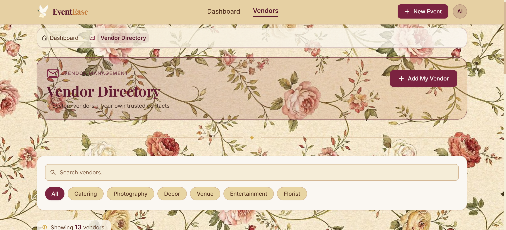

# ✨ EventEase

> A modern event management platform engineered for clarity, scalability, and seamless user experience.

EventEase is a full-stack event management system designed to simplify how users create, organize, and manage events in real time. Built with a **React + Vite frontend** and a **Node.js/Express backend**, it follows a modular architecture that prioritizes scalability, clean separation of concerns, and developer experience.

---

## 🌐 Live Demo
Experience EventEase in action: **[https://eventease-xi.vercel.app/](https://eventease-xi.vercel.app/)**

---

## 🌐 Vision

Event management tools are often either overly complex or too simplistic.

**EventEase bridges that gap.**

It focuses on:
- ⚡ Fast event creation flow
- 🧠 Intuitive UX with minimal friction
- 🔐 Secure backend architecture
- 📦 Clean modular design for future scaling (notifications, analytics, invites, etc.)

---
## 🖥️ Dashboard Preview


## ✨ Events Page




## ✨ Invitation Page



## ✨ Budgets Page



## ✨ Vendors Page



---

## 🏗️ System Architecture

EventEase follows a **client-server architecture** with clear separation between UI, business logic, and data layer.

```text
Frontend (React + Vite)
        │
        ▼
REST API Layer (Express.js)
        │
        ▼
Controller Layer (Business Logic)
        │
        ▼
```

Database Layer (MongoDB via Mongoose)
```text
EventEase/
├── backend/                # Node.js & Express backend
│   ├── controllers/        # Route handlers and business logic
│   ├── middleware/         # Custom Express middlewares (e.g., authentication)
│   ├── models/             # Mongoose database schemas
│   ├── routes/             # API route definitions
│   ├── .env                # Environment variables for the backend
│   ├── package.json        # Backend dependencies and scripts
│   └── server.js           # Entry point for the backend server
│
├── frontend/               # React & Vite frontend
│   ├── public/             # Static assets
│   ├── src/                # React source code (components, pages, context, etc.)
│   ├── index.html          # Main HTML entry point
│   ├── package.json        # Frontend dependencies and scripts
│   ├── tailwind.config.js  # Tailwind CSS configuration
│   └── vite.config.js      # Vite configuration
│
└── README.md               # Project documentation
```

## 🚀 How to Start

To run the EventEase project locally, you will need to start both the backend server and the frontend development server.

### Prerequisites
- [Node.js](https://nodejs.org/) installed.
- A running MongoDB database (local or MongoDB Atlas).

### 1. Starting the Backend

Open a terminal and navigate to the `backend` directory:

```bash
cd backend
```

Install the dependencies:

```bash
npm install
```

> **Note:** Ensure you have your `.env` file correctly configured in the `backend` directory with all required environment variables (like database connection string, JWT secrets, etc.).

Start the development server:

```bash
npm run dev
```
*The backend server typically runs on port 5000 (or the port specified in your `.env`).*

### 2. Starting the Frontend

Open a new terminal window/tab and navigate to the `frontend` directory:

```bash
cd frontend
```

Install the dependencies:

```bash
npm install
```

Start the Vite development server:

```bash
npm run dev
```
*The frontend will start on a local port (usually `http://localhost:5173`) and you can view it in your browser.*

## 👥 Contributors

This project is developed and maintained by:

- **Ayka Imran**
- **Maryam Irshad**
